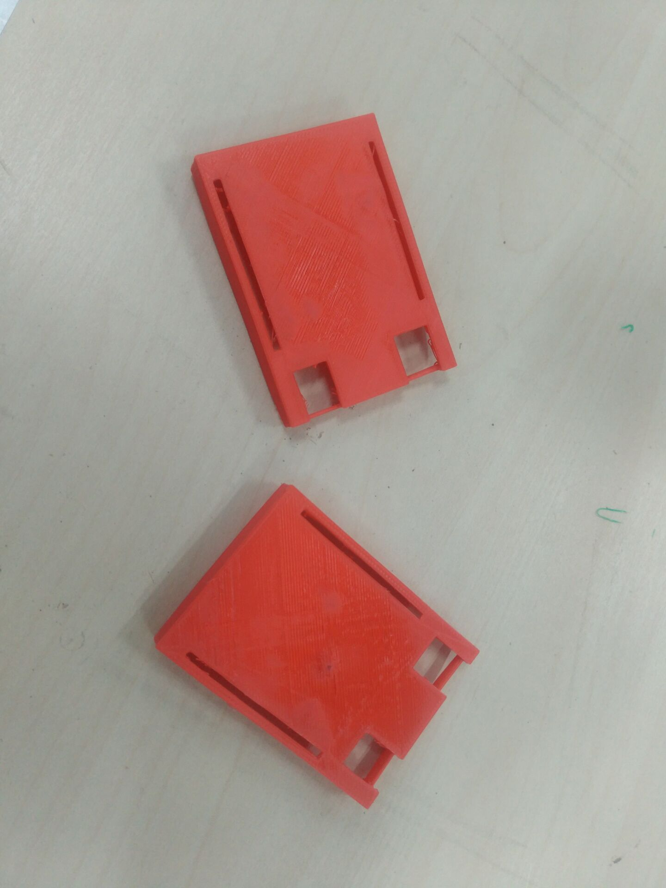

# group-4-creation
## 这是一个超级有活力的小组，以下是小组成员信息

### 信息科学与技术学院 电科（微电子方向）*吕健雄* 842270299 tel:15858164936
### 机械工程学院      建筑环境与能源应用 *张彦桢* 2337396899
### 茅以升学院  金融       *廖妮* 1423047650
### 公共管理与政法学院  法学四班         *苏容钰*   学号：2016116176 Tel:15147707500 小梦想：本学期在努力学习雅思，今后有出国打算，学精法学专业课

## 学习历程
###

