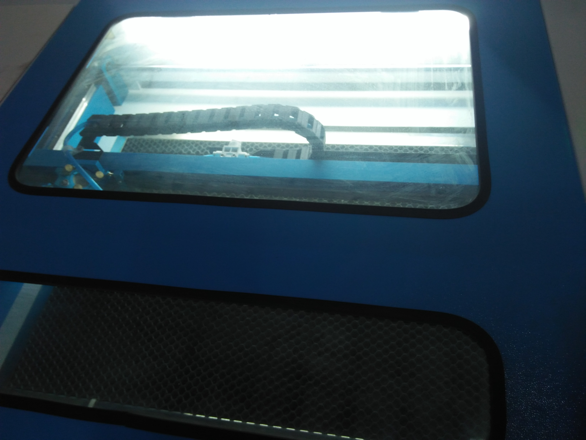

Group-4-Creation
==========

## 这是一个超级有活力的小组，以下是小组成员信息

1. 信息科学与技术学院 电科（微电子方向）**吕健雄** 842270299
2. 机械工程学院 建筑环境与能源应用 **张彦桢** 2337396899
3. 茅以升学院 金融 **廖妮** 1423047650
4. 公共管理与政法学院 法学四班 **苏容钰**   学号：2016116176 小梦想：本学期在努力学习雅思，今后有出国打算，学精法学专业课

## 学习历程

### 激光切割
激光切割是一门特别有趣的课程，它让我们小组学会了如何利用标准化的草图设计和精确的切割技术制作符合心中设计理想的制作产品。
http://www.makercase.com/ 
这个网站只只能够在线使用，把盒子的轮廓图纸画好并导出为.SVG文件。

> (*设计的盒子，长，宽，高尽量不超过10cm*)

#### 激光切割的材料
激光切割的材料有如下三种：
1. 金属板（钢/铝等）
2. 椴木亚克力板
3. 三合板
#### 激光切割的过程

> 使用该设备进行激光切割

> 在这个操作平台上进行操作和控制

> 这是激光操作平台的注意事项，这也是激光雕刻的成果，看起来很Geek呢

> 这是原始材料，过会就完全不同啦

> 过程中看着炽热的激光切割着木板，空气中散发着浓浓的烧焦木头的味道，仿佛又回想起那个野外烧烤的夜晚。

> 火热出炉（其实一点都不热）

> 小盒的最终成果！
#### 激光切割注意事项
1. 在使用激光切割机之前要仔细阅读注意事项，避免带来不必要的损伤.
2. 免被激光烧伤——放置材料并调整好位置，盖上机盖，最后打开激光.
3. 避免吸入有害气体——保持室内通风.                        
4. 防火安全——激光切割机工作时不要离开.
5. 激光切割机电流不要过大.

### 3D打印
#### fusion 360学习
在正式使用3D打印机我们要先学会建模.
老师给我们介绍的软件是fusion 360,同样是Autodesk旗下的产品，Fusion 360具有普通绘图软件都具有的功能，比如绘制平面几何图形，矩阵等功能。
下载之后安装，具体操作界面如下：

#### 3D打印的操作流程

##### 第一步是开机 ：
1. 接入电源、按下开关。
2. 观察前面板指示灯闪烁、对应蜂鸣器鸣叫提示已经正确启动。
3. 等待机器出现操作界面。

##### 第二步是装载材料：
1. 操作拨轮开关，选择 “换料＆调平”——“换料＆测试”。
2. 此时挤出机会移动到平台中央，并开始加热挤出机1—2分钟左右，喷头温度达到200℃后，按钮变成红底白字状态，，点击“继续”。
3. 检查挤出机进料口有无残余丝材，如果有，拔除残余丝材。
4. 将耗材线头分别穿过进料管、导料卡子，随后进入挤出机，一手按住摇臂，一手向进料口垂直插入新的耗材，直至松开摇臂后材料被压住，随后将进料管固定。
> *注意：插入耗材之前检查是否已经安装好料管与料管支撑件。*
5. 点击“测试”，当你观察到耗材从喷嘴中被挤出，点击“结束”。
> *注意：自动调平前，检查打印平板上是否无杂物，并完全固定好。*

##### 第三步是调平:
1. 操作拨轮开关，选择“换料&调平”——“自动调平”——“开始”。
2. 自动测评程序后，挤出机会停在打印平面正中央上方的约1mm处。如果距离为1mm，点击应用。如果发现这个距离偏差较大，那么选择“校准”，操作滚轮调整平台上下移动（红色箭头为选中、按下拨轮开关为执行），调整喷嘴与平台之间的距离直至0.1mm，确认完成后点击“应用” 。
3. 可直接导入模型文件，直接进行打印操作；

##### 第四步是打印平台涂胶：
##### 注意事项：
1. 确认热床处在冷却状态；
2. 打印平板从机器上取出随后再进行涂胶；
3. 涂胶面积应大于打印模型的底面；
4. 在打印之前需在打印平板两颗螺钉之间涂抹一定的胶水；

##### 第五步也是最重要的一步就是打印：
1. 操作波轮开关，进入”本地文件“选项；
2. 并点击进入后，选择打印机内部存储空间预存的模型gcode文件，选择一个模型，按下波轮开关确认选择，“打印”按钮进行打印确认； 待喷头温度加热到一定温度开始自动打印；等待打印结束，从机器中取出打印平板，使用铲刀将模型取下。
##### 成果

### 其他教学内容
1. 明白了基础的通信方法
2. 学习了arduino的程序编译以及各种传感器与开发版的配合与使用
3. 了解了基本的网页设计的方法与html语言的编译 
4. 学会了python语言的基本内容
5. Github的团队协作，也使我们受益匪浅

### 总结体会
这是大学上过最有趣最能带来灵感的课程，感谢老师的辛勤付出，感谢小组成员们对结业项目的努力！
### 成果展示
#### 用Arduino制作蜂窝声光小盒
==========
##### 想法：
一个能随着环境变化而发出不同声光效果的小盒。
##### 具体功能：
一、蜂窝声光小盒在昏暗的灯光下亦或是黑暗中发出不同颜色的光芒，并播放电子音乐。
##### 材料
1. Arduino uno 一块
2. 五号四节电池盒 一个
3. 四节五号电池（6V电源）
4. 面包板 一块
5. 杜邦线 若干
6. 无源蜂鸣器 两个
7. 绿色发光二极管 五个
8. 红色发光二极管 五个
9. 蓝色发光二极管 五个
10. 彩色发光二极管 五个
11. 220欧姆电阻 若干

##### 制作流程
通过arduino IDE实现arduino uno开发板的编程，设计不同的声光音效，以及在不同温度传感输入的情况下 表现出不同的灯光效果。
>演奏单音符的原理:一首音乐由若干音符组成，每一个音符唯一对应一个频率。如果我们知道了音符相对应的频率，再让 Arduino 按照这个频率输出到蜂鸣器或喇叭，蜂鸣器或喇叭就会发出相应频率下的声音。

>蜂鸣器测试过程

###### 小灯测试过程

>成品!
