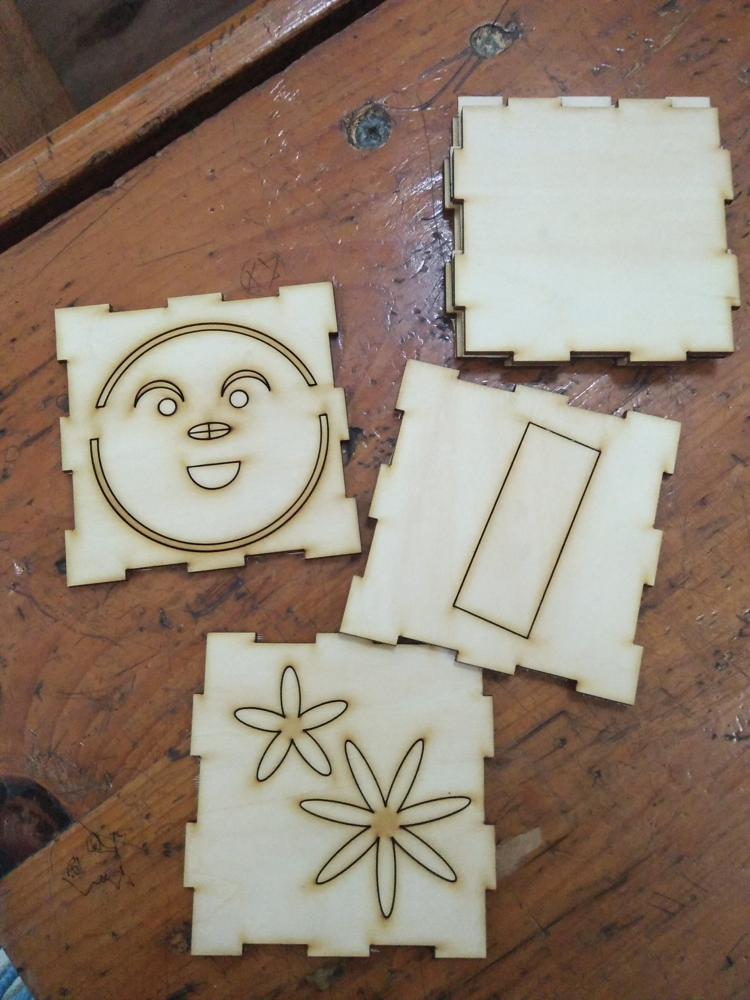

Group-4-Creation
==========

## 这是一个超级有活力的小组，以下是小组成员信息

1. 信息科学与技术学院 电科（微电子方向）**吕健雄** 842270299 tel:15858164936
2. 机械工程学院 建筑环境与能源应用 **张彦桢** 2337396899
3. 茅以升学院 金融 **廖妮** 1423047650
4. 公共管理与政法学院 法学四班 **苏容钰**   学号：2016116176 Tel:15147707500 小梦想：本学期在努力学习雅思，今后有出国打算，学精法学专业课

## 学习历程

### 激光切割
激光切割是一门特别有趣的课程，它让我们小组学会了如何利用标准化的草图设计和精确的切割技术制作符合心中设计理想的制作产品。
http://www.makercase.com/ 
这个网站只只能够在线使用，把盒子的轮廓图纸画好并导出为.SVG文件。

> (*设计的盒子，长，宽，高尽量不超过10cm*)

#### 激光切割的材料
激光切割的材料有如下三种：
1. 金属板（钢/铝等）
2. 椴木亚克力板
3. 三合板
#### 激光切割的过程

> 使用该设备进行激光切割

> 在这个操作平台上进行操作和控制

> 这是激光操作平台的注意事项，这也是激光雕刻的成果，看起来很Geek呢

> 这是原始材料，过会就完全不同啦

> 过程中看着炽热的激光切割着木板，空气中散发着浓浓的烧焦木头的味道，仿佛又回想起那个野外烧烤的夜晚。

> 火热出炉（其实一点都不热）

> 小盒的最终成果！
#### 激光切割注意事项
1. 在使用激光切割机之前要仔细阅读注意事项，避免带来不必要的损伤.
2. 免被激光烧伤——放置材料并调整好位置，盖上机盖，最后打开激光.
3. 避免吸入有害气体——保持室内通风.                        
4. 防火安全——激光切割机工作时不要离开.
5. 激光切割机电流不要过大.

### 3D打印
#### fusion 360学习
在正式使用3D打印机我们要先学会建模.
老师给我们介绍的软件是fusion 360,同样是Autodesk旗下的产品，Fusion 360具有普通绘图软件都具有的功能，比如绘制平面几何图形，矩阵等功能。
下载之后安装，具体操作界面如下：

